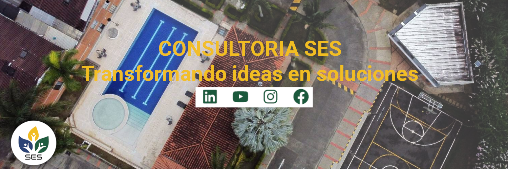

<h1 align="center">Bienvenidos al repositorio de <a href="https://consultoriases.com">Consultoria SES</a> 👋</h1>

> [!NOTE]
> Pongase en contacto con nosotros y programemos la videoconferencia
> **Celular:** +57 305 439 2506 
> **Correo:** [ses@workmail.com](mailto:ses@workmail.com) 
> **Página Web:** [consultoriases.com](https://consultoriases.com)

Consultoria SES tiene el bjetivo de llevar la consultoría ambiental y la geoanalítica a partir de sistemas de información geográfica al siguiente nivel innovando así en la forma como se estudian y desarrollan diferentes planes, programas y proyectos en lo que a lo ambiental se refiere.

En SES sabemos de la necesidad mutua de las organizaciones por los servicios especializados de consultoría ambiental y de las consultoras por apoyar a las organizaciones para alcanzar el éxito y la sostenibilidad corporativas, pero además somos conscientes de las dificultades que implica para muchas organizaciones estar a constantemente actualizados en los temas ambientales.

---
## Soluciones para Catastro

Diseñamos productos y servicios especializados que simplifican el reconocimiento predial, optimizan los procesos de conservación catastral y facilitan la difusión de información. Nuestra prioridad es garantizar la interoperabilidad de los datos, asegurando una integración fluida con diversas entidades. Con enfoque en la eficiencia y precisión, proporcionamos soluciones tecnológicas que potencian la gestión integral de la información catastral.
>1. Visores web geográficos
>2. Imágenes 360 panorámicas
>3. Imágenes drone oblícuas
>4. Ortofotos
>5. Inteligencia Artificial para reconocimiento predial

---

## Soluciones para Turismo
En Consultoría SES, hemos desarrollado una solución tecnológica integral diseñada específicamente para satisfacer las necesidades de los acueductos municipales y rurales. Nuestra solución abarca una serie de componentes que van desde la consolidación de datos de campo hasta la implementación de plataformas avanzadas de visualización y análisis.

Al utilizar nuestra solución, los acueductos pueden mejorar la eficiencia operativa, optimizar la gestión de recursos, detectar y mitigar problemas de forma proactiva, y garantizar un suministro de agua seguro y sostenible para las comunidades a las que sirven.

---

## Soluciones para difusión en la Gestión de Riesgo de Desastres

InfoRiesgo es la solución que presenta SES para sus clientes que trabajan directamente con la gestión de riesgo de desastres, en este caso y gracias a nuestras herramientas para el levantamiento de datos en campo, y a nuestra plataforma de Geovisor y Tablero de control, les permite agilizar procesos de consulta, difusión, planificación y trazabilidad en lo relacionado con la Gestión de Riesgo de Desastres 

---

## Proyecto más reciente  *TipologIA by SES*
<table>
<tr>
<td width="50%">
<h3 align="center">Portafolio de soluciones </h3>

Descubre cómo nuestras soluciones tecnológicas están transformando los procesos de diferentes organizaciones. Nuestras soluciones para  Catastro Multiproposito, Turismo, Acueductos, Gestión del Riesgo de Desastres, Ordenamiento Territorial, y Saneamiento son soluciones a medida de nuestros clientes. 💡💻

</td>
<td width="50%">
  
<h3 align="center">Presentación de TipologIA</h3>

 

TipologIA. Esta es la presentación al público de nuestra inteligencia artificial pionera en reconocimiento catastral en Colombia, capaz de identificar y categorizar las diferentes tipologías constructivas con precisión. ¡Una verdadera revolución en el mundo del catastro multipropósito! 🏘 Completamente compatible con el modelo de datos LADM-COL🤖

</table>

 

---

### ⚙️ &nbsp;GitHub Analytics

